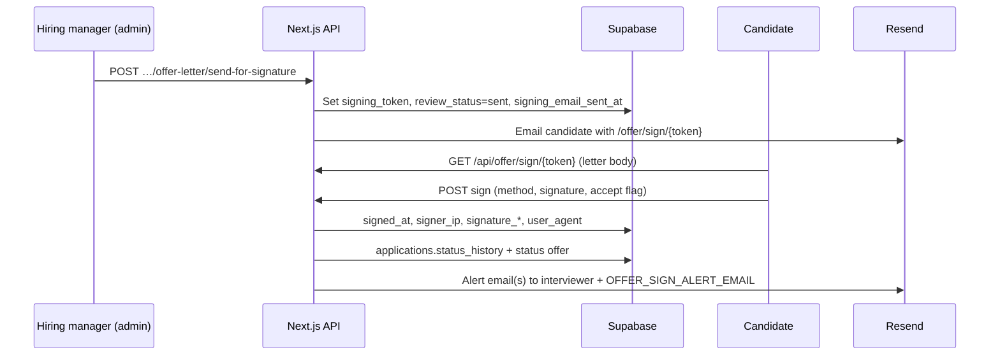

# Phase 5B — E-signature (custom in-app flow)

## Why Option B (custom portal) vs DocuSign / PandaDoc

We implemented a **lightweight in-app signing** experience instead of a third-party e-sign API because:

1. **No extra vendor onboarding** — No OAuth apps, envelope APIs, or webhook signature verification on top of Vercel/Supabase.
2. **Predictable costs and demo-ability** — Works with existing **Resend** + **Postgres** only.
3. **Requirements map directly** — Capture **signature** (typed legal name or drawn PNG), **server timestamp**, **client IP** (`x-forwarded-for` / `x-real-ip`), and **user-agent**; **alert hiring** immediately via email and **dashboard flags** on the candidate admin page.

For enterprise legal defensibility (certificate of completion, long-term vaulting), you would swap this for **Option A** (DocuSign / PandaDoc / Dropbox Sign) and replace the public `/offer/sign/[token]` flow with “Create envelope → webhook on `envelope-completed`”.

## Flow

## Environment

| Variable | Purpose |
|----------|---------|
| `NEXT_PUBLIC_BASE_URL` | Absolute links in signing emails (e.g. `https://candidate-filtering.vercel.app`). |
| `RESEND_API_KEY`, `RESEND_FROM_EMAIL` | Candidate signing link + hiring alerts. |
| `OFFER_SIGN_ALERT_EMAIL` | Optional comma-separated extra inboxes for “offer signed” alerts. |

Primary alert recipient defaults to **`interviewerEmail`** on the role in `lib/jobs.ts`.

## Database

Migration `20260409120000_offer_signing.sql` adds to `offer_letters`:

- `signing_token` (unique when set)
- `signing_email_sent_at`
- `signed_at`, `signer_ip`, `signature_method` (`typed` | `drawn`), `signature_captured`, `signer_user_agent`

## Security notes

- Signing links are **unguessable UUIDs**; treat them like secrets (HTTPS only in production).
- **Admin-only** APIs remain behind your existing admin cookie gate; **`/offer/*`** is public by design (middleware only matches `/admin`).
- Drawn signatures are stored as **PNG data URLs** (size-capped server-side).

## “Webhooks” equivalent

There is **no external webhook**: completion is handled **synchronously** in `POST /api/offer/sign/[token]` (DB write + email). For DocuSign-style async completion, you would add a signed webhook route and idempotent processing instead.
